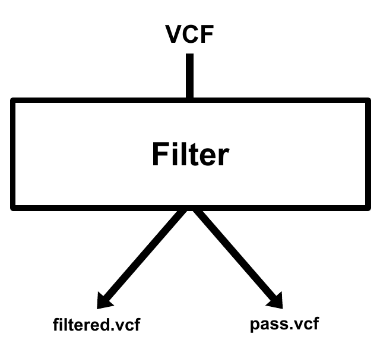

<p align="center">
  
</p>

----

# Python packages

:file_folder: Packages from the [Python Standard Library](https://docs.python.org/3/library/) used:

  - [collections](https://docs.python.org/3/library/collections.html)
  - [copy](https://docs.python.org/3/library/copy.html)
  - [itertools](https://docs.python.org/3/library/itertools.html)
  - [logging](https://docs.python.org/3/library/logging.html)
  - [os](https://docs.python.org/3/library/os.html)
  - [pathlib](https://docs.python.org/3/library/pathlib.html)
  - [pickle](https://docs.python.org/3/library/pickle.html)
  - [sys](https://docs.python.org/3/library/sys.html)
  - [uuid](https://docs.python.org/3/library/uuid.html)
  - [warnings](https://docs.python.org/3/library/warnings.html)
  
:file_folder: Required python packages to run g-LOTUS:
  
  - [matplotlib](https://matplotlib.org/)
  - [more_itertools](https://more-itertools.readthedocs.io/en/stable/)
  - [numpy](https://numpy.org/)
  - [pandas](https://pandas.pydata.org/)
  - [pyfastx](https://pyfastx.readthedocs.io/en/latest/)
  - [pytest](https://docs.pytest.org/en/7.2.x/)
  - [tqdm](https://tqdm.github.io/)

<sub>:warning: These packages must be installed before you can use g-LOTUS.</sub>
  
----

# g-LOTUS informations

g-LOTUS is composed of the following four modules to process vcf files from GATK output (annotated with Funcotator):

<p align="center">
  <a href="https://github.com/gsiekaniec/g-LOTUS#-filter">
    
  </a>
  <a href="https://github.com/gsiekaniec/g-LOTUS#-summarise">
    
  </a>
  <a href="https://github.com/gsiekaniec/g-LOTUS#-compare">
    
  </a>
  <a href="https://github.com/gsiekaniec/g-LOTUS#-merge">
    
  </a>
</p>

----

## 🧬 Preliminary steps

If we start from a basic fastq file, before using g-LOTUS many steps are necessary to go from **fastq** (sequences) to **annotated vcf** (variants). <br>
For that there are many ways to proceed, we advise here to use the [GATK best practices](https://gatk.broadinstitute.org/hc/en-us/articles/360035894731-Somatic-short-variant-discovery-SNVs-Indels-)[^1]. :warning: In particular, g-LOTUS can currently only handle VCF annotations from GATK's Funcotator software.  

[^1]: [DePristo M, Banks E, Poplin R, Garimella K, Maguire J, Hartl C, Philippakis A, del Angel G, Rivas MA, Hanna M, McKenna A, Fennell T, Kernytsky A, Sivachenko A, Cibulskis K, Gabriel S, Altshuler D, Daly M. (2011). A framework for variation discovery and genotyping using next-generation DNA sequencing data. Nat Genet, 43:491-498. DOI: 10.1038/ng.806.](https://www.nature.com/articles/ng.806)

<p align="center">
  
</p>

----

## 🧬 Filter

Simple filter on the vcf file from Funcotator using multiple informations to keep only trustworthy somatic variants.

<p align="center">
  
</p>

Two output files: (1) the filtered.vcf file contains the variants of the original vcf file with an annotation indicating the filters not passed in the Info field. (2) The pass.vcf file contains only the variants passing the filters. 

<details><summary>Parameters</summary>

| Parameters | Description | Default |
|----------|:-------------:|:-------------:|
| --vcf, -v | Result vcf file from Funcotator output. |  |
| --output, -o | Filtered vcf file. The Pass vcf file is also create using this output name. | output.filtered.vcf |
| --working-method, -w | "InMemory" (default) loads the vcf file in memory into a list (more speed but higher memory consumption) or "Direct" reads and modifies the vcf file on the fly (slow speed but low memory consumption). | InMemory |
| --MBQ | Minimum median base variant quality for variant. | 20 |
| --DP | Minimum variant coverage. | 10 |
| --AF | Minimum fractions of variant in the tumor. | 0.1 |
| --AD | Minimum variant depths. | 5 |
| --POPAF | Maximum population (often GnomAD) variant frequencies. | 0.00001 |

</details>

----

## 🧬 Summarise

Allows to extract a lot of statistics from a vcf file.

<details><summary>Parameters</summary>

| Parameters | Description | Default |
|----------|:-------------:|:-------------:|
| --vcf, -v | Vcf file containing variants that pass filter (*.filtered.pass.vcf). | None |
| --vcf_pass, -vp | Vcf file containing variants that pass filter (*.filtered.pass.vcf). |  |
| --genome, -g | Genome fasta file (allowed extensions : .fasta, .fa, .fan) or pickle (.pk, .pickle) file created after a first run. |  |
| --statistics, -s | Output statistics file. | stats.txt |
| --genes, -genes | Output file containing genes impacted by variants. | genes.txt |
| --profile, p | SVG file that shows the mutations profile of the vcf file. | profil.svg |
| --indel, -i | SVG file that shows the indel mutations size of the vcf file. | indel.svg |
| --enrichment | Did the GO enrichment analysis on the genes list using ToppGene and Panther and returns the biological processes (works if the APIs are not down). | False |

</details>

----

## 🧬 Compare

Compare multiple vcf files longitudinally.

<details><summary>Parameters</summary>

| Parameters | Description | Default |
|----------|:-------------:|:-------------:|
| --config, -c | Configuration file containing path to vcf file (filtered.vcf and pass.vcf file from g-LOTUS filter) and tsv files for indel and snp from g-LOTUS summarise. Example available [here](https://github.com/gsiekaniec/g-LOTUS/blob/main/example_config.txt). |  |
| --output, -o | Excel file containing the genes specific to the first or second biopsy. | "genes.xlsx" wich give "{vcf1}_{vcf2}_genes.tsv/.xlsx". |
| --profile, -p | SVG file that shows the comparison between mutations profiles of the two vcf file. | "profile.svg" wich give "{vcf1}_{vcf2}_profile.svg". |
| --indel, -i | SVG file that shows the indel mutations size of the vcf file. | "indel.svg" wich give "{vcf1}_{vcf2}_indel.svg". |
| --enrichment | Did the GO enrichment analysis on the genes list using ToppGene and Panther and returns the biological processes (works if the APIs are not down). | False |

</details>

----

## 🧬 Merge

Merging results to find the genes impacted in all patient.

<details><summary>Parameters</summary>

| Parameters | Description | Default |
|----------|:-------------:|:-------------:|
| --config, -c | Configuration file containing genes list from all patients. Merged patients results. |  |
| --output, -o | Output file name. | union.xlsx |
| --upset, -u | Output name for upset plot. | upset_plot.svg |
| --weakness_threshold, -wt | Mean weakness threshold to save take a gene into account. | 100 |
| --min_subset_size, -minsb | Minimum size of a subset (nb of genes by subset) to be shown in the UpSetPlot. All subsets with a size smaller than this threshold will be omitted from plotting. | 1 |
| --max_subset_size, -maxsb | Maximum size of a subset (nb of genes by subset) to be shown in the UpSetPlot. All subsets with a size greater than this threshold will be omitted from plotting. | 0 |
| --min_degree, -mind | Minimum degree of a subset (nb of patients) to be shown in the UpSetPlot. | 1 |
| --max_degree, -maxd | Maximum degree of a subset (nb of patients) to be shown in the UpSetPlot. | 0 |
  
</details>


----


# Tests

To run tests:

``` 
python -m py.test tests
```
