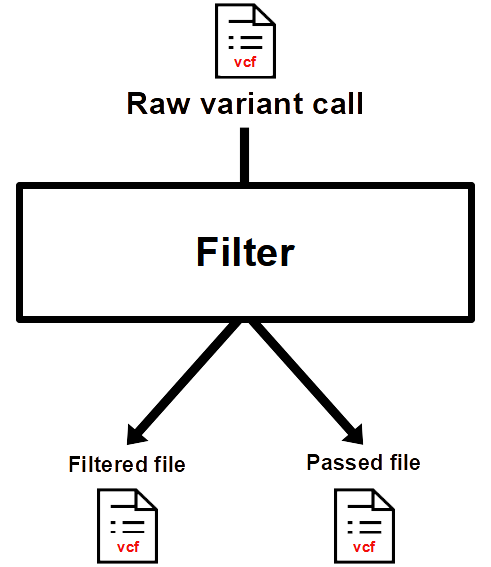
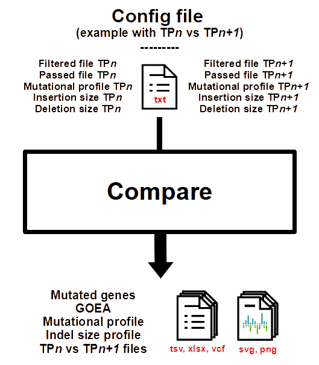
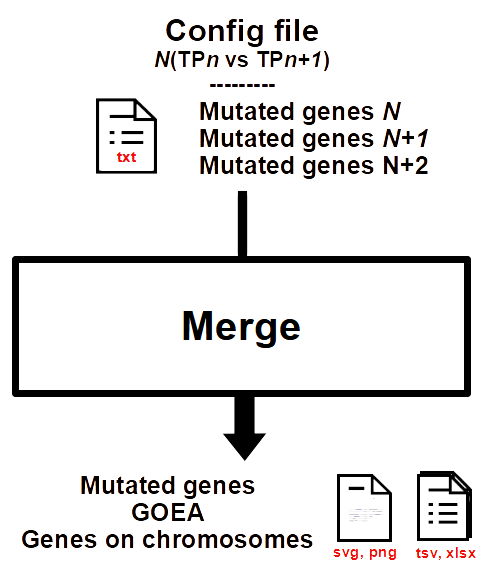

<p align="center">
  
</p>

----

# Installation

Two ways to install LOTUS are presented [here](https://github.com/gsiekaniec/LOTUS/tree/main/conda#lotus-installation), the easiest way is the following:
```
conda create -p lotus_env
conda activate lotus_env
conda install -c gsiekaniec -c conda-forge -c bioconda lotus
```

> __Warning__
In case the installation is done this way the external files will be missing and must be retrieved from the [LOTUS github](https://github.com/gsiekaniec/LOTUS/tree/main/LOTUS_external_files): [reference genome annotation file](https://github.com/gsiekaniec/LOTUS/tree/main/inputs_outputs_description#reference-genome-annotation-file) ```Homo_sapiens.GRCh38.108.chr.gff3.gz```, [cytoband file](https://github.com/gsiekaniec/LOTUS/tree/main/inputs_outputs_description#cytoband-file) ```hg38_cytoband.tsv``` and [external databases file](https://github.com/gsiekaniec/LOTUS/tree/main/inputs_outputs_description#mutated-genes-file-1) ```Lotus_ExternalBases_202301.xlsx```. 

----

# LOTUS informations

LOTUS is composed of the following four modules to process vcf files from GATK output (annotated with Funcotator):

<p align="center">
  <a href="https://github.com/gsiekaniec/LOTUS#-filter">
    
  </a>
  <a href="https://github.com/gsiekaniec/LOTUS#-summarise">
    
  </a>
  <a href="https://github.com/gsiekaniec/LOTUS#-compare">
    
  </a>
  <a href="https://github.com/gsiekaniec/LOTUS#-merge">
    
  </a>
</p>

> __Note__
> In order to simplify the output of the files it can be interesting to create a *results* folder with the following tree structure:
```bash
results
  |
  +-- filter
  |
  +-- summarise
  |
  +-- compare
  |
  +-- merge
```

Details of the output and input files for every module can be found in the [inputs_outputs_description](https://github.com/gsiekaniec/LOTUS/tree/main/inputs_outputs_description#description-of-the-inputoutput-files) directory.

---

## 🧬 Preliminary steps

If we start from a basic fastq file, before using LOTUS many steps are necessary to go from **fastq** (sequences) to **annotated vcf** (variants). <br>
For that there are many ways to proceed, we advise here to use the [GATK best practices](https://gatk.broadinstitute.org/hc/en-us/articles/360035894731-Somatic-short-variant-discovery-SNVs-Indels-)[^1]. :warning: In particular, LOTUS can currently only handle VCF annotations from GATK's Funcotator software.  

[^1]: [Van der Auwera GA, Carneiro M, Hartl C, Poplin R, del Angel G, Levy-Moonshine A, Jordan T, Shakir K, Roazen D, Thibault J, Banks E, Garimella K, Altshuler D, Gabriel S, DePristo M. (2013). From FastQ Data to High-Confidence Variant Calls: The Genome Analysis Toolkit Best Practices Pipeline. Curr Protoc Bioinformatics, 43:11.10.1-11.10.33. DOI: 10.1002/0471250953.bi1110s43.](https://currentprotocols.onlinelibrary.wiley.com/doi/10.1002/0471250953.bi1110s43)

<p align="center">
  
</p>

----

## 🧬 Filter

### Main purpose

Simple filters on the vcf file from Funcotator using multiple informations to keep only trustworthy somatic variants.

### Inputs/Outputs [(get more details)](https://github.com/gsiekaniec/LOTUS/tree/main/inputs_outputs_description#filter)

<p align="center">
  
</p>

<details><summary>Parameters</summary>

| Parameters | Description | Default |
|----------|:-------------:|:-------------:|
| --vcf, -v | Result vcf file from Funcotator output. |  |
| --output, -o | Filtered vcf file. The Passed vcf file is also create using this output name. | output.filtered.vcf and output.passed.vcf |
| --working-method, -w | "InMemory" (default) loads the vcf file in memory into a list (more speed but higher memory consumption) or "Direct" reads and modifies the vcf file on the fly (slow speed but low memory consumption). | InMemory |
| --MBQ | Minimum median base variant quality for variant. | 20 |
| --DP | Minimum variant coverage. | 10 |
| --AF | Minimum fractions of variant in the tumor. | 0.1 |
| --AD | Minimum variant depths. | 5 |
| --POPAF | Maximum population (often GnomAD) variant frequencies. | 0.00001 |
| --unpaired | Argument to use if the reads used are unpaired (single end), put False in the paired variable. | True |
  
</details>

### Command line examples

#### Basic
```
lotus filter -v {PATH_TO_VCF}/sample.funcotated.vcf -o {OUTPUT_PATH}/sample.vcf
```

#### Complete
```
lotus filter -v {PATH_TO_VCF}/sample_unpaired_reads.funcotated.vcf -o {OUTPUT_PATH}/sample.vcf -wm Direct --MBQ 20 --DP 10 --AF 0.1 --AD 5 --POPAF 0.00001 --unpaired
```

----

## 🧬 Summarise

### Main purpose

The *summarise* module provides information on the variants from the vcf files, including statistics on the number and nature of variants passing or not passing the filters, graphs representing the mutational profiles or the size of the indels and the list of impacted genes and their tumor burden.

### Inputs/Outputs [(get more details)](https://github.com/gsiekaniec/LOTUS/tree/main/inputs_outputs_description#summarise)

<p align="center">
  
</p>

<details><summary>Parameters</summary>

| Parameters | Description | Default |
|----------|:-------------:|:-------------:|
| --vcf, -v | Vcf file containing variants that pass filter (*.filtered.pass.vcf). | None |
| --vcf_pass, -vp | Vcf file containing variants that pass filter (*.filtered.pass.vcf). |  |
| --genome, -g | Genome fasta file (allowed extensions : .fasta, .fa, .fan) or pickle (.pk, .pickle) file created after a first run. |  |
| --statistics, -s | Output statistics file. | stats.txt |
| --genes, -genes | Output file containing genes impacted by variants. | genes.txt |
| --profile, p | SVG|PNG file that shows the mutations profile of the vcf file. | profil.svg |
| --indel, -i | SVG|PNG file that shows the indel mutations size of the vcf file. | indel.svg |
| --enrichment | Did the GO enrichment analysis on the genes list using ToppGene and Panther and returns the biological processes (works if the APIs are not down). | False |

</details>

### Command line examples

#### Basic
```
lotus summarise -vp {FILTER_OUTPUT_PATH}/sample.passed.vcf -g hg38.fasta
```

#### Complete
```
lotus summarise -vp {FILTER_OUTPUT_PATH}/sample.passed.vcf -v {FILTER_OUTPUT_PATH}/sample.filtered.vcf -s {SUMMARISE_OUTPUT_PATH}/sample.stats.txt -p {SUMMARISE_OUTPUT_PATH}/sample_profile.svg -i {SUMMARISE_OUTPUT_PATH}/sample_indel.svg -g ../hg38.fasta -genes {SUMMARISE_OUTPUT_PATH}/sample.tsv --enrichment
```

> __Note__
```hg38.fasta``` represents the [reference genome fasta file](https://github.com/gsiekaniec/LOTUS/tree/main/inputs_outputs_description#reference-genome-fasta-file).


----

## 🧬 Compare

### Main purpose

The *compare* module allows a longitudinal comparative genomic analysis of the vcf files of a sample in order to determine the variants present at a time point (TP*n*) and disappearing/appearing at a time point (TP*n+1*) as well as the genes impacted by these variants.

### Inputs/Outputs [(get more details)](https://github.com/gsiekaniec/LOTUS/tree/main/inputs_outputs_description#compare)

<p align="center">
  
</p>

<details><summary>Parameters</summary>

| Parameters | Description | Default |
|----------|:-------------:|:-------------:|
| --config, -c | Configuration file containing path to vcf file (filtered.vcf and pass.vcf file from LOTUS filter) and tsv files for indel and snp from LOTUS summarise. Example available [here](https://github.com/gsiekaniec/LOTUS/blob/main/example_config.txt). |  |
| --gff3, -gff3 | Gff3 file. This file can be found [here](https://ftp.ensembl.org/pub/release-108/gff3/homo_sapiens/) or in [LOTUS](https://github.com/gsiekaniec/LOTUS/blob/main/LOTUS_external_files/Homo_sapiens.GRCh38.108.chr.gff3.gz). |  |  
| --output, -o | Excel file containing the genes specific to the first or second biopsy. | "genes.xlsx" wich give "{vcf1}_{vcf2}_genes.tsv/.xlsx" |
| --profile, -p | SVG|PNG file that shows the comparison between mutations profiles of the two vcf file. | "profile.svg" wich give "{vcf1}_{vcf2}_profile.svg" |
| --indel, -i | SVG|PNG file that shows the indel mutations size of the vcf file. | "indel.svg" wich give "{vcf1}_{vcf2}_indel.svg" |
| --enrichment | Did the GO enrichment analysis on the genes list using ToppGene and Panther and returns the biological processes (works if the APIs are not down). | False |
| --pickle_gff3 | Did the gff3 file given is a pickle file from previous lauch ? | False |
| --additional_gene_information | Add gene informations using the [LOTUS file](https://github.com/gsiekaniec/LOTUS/blob/main/LOTUS_external_files/Lotus_ExternalBases_202301.xlsx) containing information from tumorspecific database (CancerHotSpot, CIViC, COSMIC, DoCM, IntOGen and TSGene 2.0). | False |
| --profile_proportion_off | Get different y-axis for the snp profile plot. Useful when one of the two axes is flattened by the size of the other one. | False |
</details>

### Command line examples

#### Basic
```
lotus compare -c config_compare_sample.txt -gff3 LOTUS_external_files/Homo_sapiens.GRCh38.108.chr.gff3.gz
```

#### Complete
```
lotus compare -c config_compare_sample.txt -gff3 LOTUS_external_files/Homo_sapiens.GRCh38.108.chr.gff3.pk -i {COMPARE_OUTPUT_PATH}/sample_indel.svg -o {COMPARE_OUTPUT_PATH}/compare.tsv -p {COMPARE_OUTPUT_PATH}/sample_profile.svg --additional_gene_information --enrichment --pickle_gff3 --profile_proportion_off
```

----

## 🧬 Merge

### Main purpose

The *merge* module allows to have an overview of all the samples, it allows to group and compare all TP*n* against all TP*n+1*.

### Inputs/Outputs [(get more details)](https://github.com/gsiekaniec/LOTUS/tree/main/inputs_outputs_description#merge)

<p align="center">
  
</p>

<details><summary>Parameters</summary>

| Parameters | Description | Default |
|----------|:-------------:|:-------------:|
| --config, -c | Configuration file containing genes list from all patients. Merged patients results. |  |
| --output, -o | Ouput file name. | union.xlsx |
| --cytoband, -cyto | Human cytoband file for the corresponding genome version. This file can be download [here](https://genome.ucsc.edu/cgi-bin/hgTables) or find the [LOTUS github](https://github.com/gsiekaniec/LOTUS/blob/main/LOTUS_external_files/hg38_cytoband.tsv) (for hg38). If this file is not provided the chromosome.svg plot will not be created. | None |
| --chromosome-step, -step | Frame used for counting the number of genes along the chromosomes. | 500000 |
| --chromosomes_output, -co | Output file name for the chromosomes plot. | chromosomes.svg |
| --upset, -u | Output name for upset plot. The upset plot is not created if no name is given. :warning: It can actually only handle a maximum of 15 files due to the explosion of the combination but this limitation should be lifted in the next version. | None |
| --weakness_threshold, -w | Mean weakness threshold to take a gene into account. | 100 |
| --min_subset_size, -minsb | Minimum size of a subset (nb of genes by subset) to be shown in the UpSetPlot. All subsets with a size smaller than this threshold will be omitted from plotting. | 1 |
| --max_subset_size, -maxsb | Maximum size of a subset (nb of genes by subset) to be shown in the UpSetPlot. All subsets with a size greater than this threshold will be omitted from plotting. | 0 |
| --min_degree, -mind | Minimum degree of a subset (nb of patients) to be shown in the UpSetPlot. | 1 |
| --max_degree, -maxd | Maximum degree of a subset (nb of patients) to be shown in the UpSetPlot. | 0 |
| --additional_gene_information | Add gene informations using the [LOTUS file](https://github.com/gsiekaniec/LOTUS/blob/main/LOTUS_external_files/Lotus_ExternalBases_202301.xlsx) containing information from tumorspecific database (CancerHotSpot, CIViC, COSMIC, DoCM, IntOGen and TSGene 2.0). | False |
| --enrichment | Did the GO enrichment analysis on the genes list using ToppGene and Panther and returns the biological processes (works if the APIs are not down). | False |
  
</details>

### Command line examples

#### Basic
```
lotus merge -c config_merge.txt
```

#### Complete
```
lotus merge -c config_merge.txt -o {MERGE_OUTPUT_PATH}/union.xlsx -cyto LOTUS_external_files/hg38_cytoband.tsv -w 99 -co {MERGE_OUTPUT_PATH}/chromosomes.svg -step 500000 --additional_gene_information --enrichment
```

<details><summary>Future plot</summary>
  
Currently LOTUS allows to create an UpsetPlot[^2] representing for each sample set the corresponding impacted gene set. However, due to the high computational complexity, this graph is only available for a maximum of 15 samples. The passage to a larger number is envisaged in the future. 

[^2]: [A. Lex, N. Gehlenborg, H. Strobelt, R. Vuillemot and H. Pfister, "UpSet: Visualization of Intersecting Sets," in IEEE Transactions on Visualization and Computer Graphics, vol. 20, no. 12, pp. 1983-1992, 31 Dec. 2014, doi: 10.1109/TVCG.2014.2346248.](https://ieeexplore.ieee.org/document/6876017)

</details>
