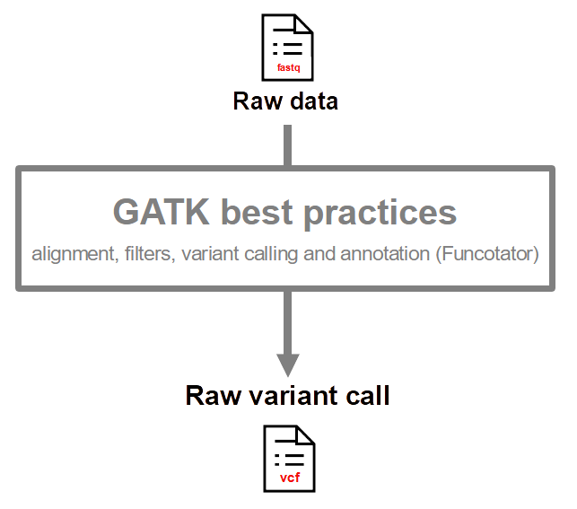
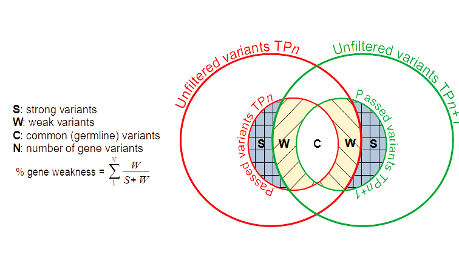

<p align="center">
  
</p>

----

# Python packages

:file_folder: Packages from the [Python Standard Library](https://docs.python.org/3/library/) used:

  - [collections](https://docs.python.org/3/library/collections.html)
  - [copy](https://docs.python.org/3/library/copy.html)
  - [itertools](https://docs.python.org/3/library/itertools.html)
  - [logging](https://docs.python.org/3/library/logging.html)
  - [os](https://docs.python.org/3/library/os.html)
  - [pathlib](https://docs.python.org/3/library/pathlib.html)
  - [pickle](https://docs.python.org/3/library/pickle.html)
  - [sys](https://docs.python.org/3/library/sys.html)
  - [uuid](https://docs.python.org/3/library/uuid.html)
  - [warnings](https://docs.python.org/3/library/warnings.html)
  
:file_folder: Required python packages to run LOTUS:
  
  - [matplotlib](https://matplotlib.org/)
  - [more_itertools](https://more-itertools.readthedocs.io/en/stable/)
  - [numpy](https://numpy.org/)
  - [pandas](https://pandas.pydata.org/)
  - [pyfastx](https://pyfastx.readthedocs.io/en/latest/)
  - [pytest](https://docs.pytest.org/en/7.2.x/)
  - [tqdm](https://tqdm.github.io/)

<sub>:warning: These packages must be installed before you can use LOTUS.</sub>
  
----

# LOTUS informations

LOTUS is composed of the following four modules to process vcf files from GATK output (annotated with Funcotator):

<p align="center">
  <a href="https://github.com/gsiekaniec/LOTUS#-filter">
    
  </a>
  <a href="https://github.com/gsiekaniec/LOTUS#-summarise">
    
  </a>
  <a href="https://github.com/gsiekaniec/LOTUS#-compare">
    
  </a>
  <a href="https://github.com/gsiekaniec/LOTUS#-merge">
    
  </a>
</p>

----

## 🧬 Preliminary steps

If we start from a basic fastq file, before using LOTUS many steps are necessary to go from **fastq** (sequences) to **annotated vcf** (variants). <br>
For that there are many ways to proceed, we advise here to use the [GATK best practices](https://gatk.broadinstitute.org/hc/en-us/articles/360035894731-Somatic-short-variant-discovery-SNVs-Indels-)[^1]. :warning: In particular, LOTUS can currently only handle VCF annotations from GATK's Funcotator software.  

[^1]: [Van der Auwera GA, Carneiro M, Hartl C, Poplin R, del Angel G, Levy-Moonshine A, Jordan T, Shakir K, Roazen D, Thibault J, Banks E, Garimella K, Altshuler D, Gabriel S, DePristo M. (2013). From FastQ Data to High-Confidence Variant Calls: The Genome Analysis Toolkit Best Practices Pipeline. Curr Protoc Bioinformatics, 43:11.10.1-11.10.33. DOI: 10.1002/0471250953.bi1110s43.](https://currentprotocols.onlinelibrary.wiley.com/doi/10.1002/0471250953.bi1110s43)

<p align="center">
  
</p>

----

## 🧬 Filter

Simple filter on the vcf file from Funcotator using multiple informations to keep only trustworthy somatic variants.

<p align="center">
  
</p>

Two output files: (1) the filtered.vcf file contains the variants of the original vcf file with an annotation indicating the filters not passed in the Info field. (2) The pass.vcf file contains only the variants passing the filters. 

<details><summary>Parameters</summary>

| Parameters | Description | Default |
|----------|:-------------:|:-------------:|
| --vcf, -v | Result vcf file from Funcotator output. |  |
| --output, -o | Filtered vcf file. The Pass vcf file is also create using this output name. | output.filtered.vcf |
| --working-method, -w | "InMemory" (default) loads the vcf file in memory into a list (more speed but higher memory consumption) or "Direct" reads and modifies the vcf file on the fly (slow speed but low memory consumption). | InMemory |
| --MBQ | Minimum median base variant quality for variant. | 20 |
| --DP | Minimum variant coverage. | 10 |
| --AF | Minimum fractions of variant in the tumor. | 0.1 |
| --AD | Minimum variant depths. | 5 |
| --POPAF | Maximum population (often GnomAD) variant frequencies. | 0.00001 |

</details>

----

## 🧬 Summarise

Allows to extract a lot of statistics from a vcf file.

<p align="center">
  
</p>

<details><summary>Parameters</summary>

| Parameters | Description | Default |
|----------|:-------------:|:-------------:|
| --vcf, -v | Vcf file containing variants that pass filter (*.filtered.pass.vcf). | None |
| --vcf_pass, -vp | Vcf file containing variants that pass filter (*.filtered.pass.vcf). |  |
| --genome, -g | Genome fasta file (allowed extensions : .fasta, .fa, .fan) or pickle (.pk, .pickle) file created after a first run. |  |
| --statistics, -s | Output statistics file. | stats.txt |
| --genes, -genes | Output file containing genes impacted by variants. | genes.txt |
| --profile, p | SVG file that shows the mutations profile of the vcf file. | profil.svg |
| --indel, -i | SVG file that shows the indel mutations size of the vcf file. | indel.svg |
| --enrichment | Did the GO enrichment analysis on the genes list using ToppGene and Panther and returns the biological processes (works if the APIs are not down). | False |

</details>

----

## 🧬 Compare

Compare multiple vcf files longitudinally.

<p align="center">
  
</p>

Compare introduces a new concept of weakness and weakness percentage.

To make it simple, when comparing two vcf files coming from the same individual in a longitudinal way, we compare the variants of the two vcf. To do this, we use the files with the variants that pass the filters (LOTUS and GATK).

In the case of LOTUS the files containing the variants that do not pass these filters are also used. We can then consider two types of variants: 
  - (1) the so-called strong variants (*S* in the figure below) are those which are found in one of the two files but not in the variants which do not pass the filters in the other file.
  - (2) the so-called weak variants (*W* in the figure below) are those that pass the filters in one of the two files but are also found in the filtered variants of the other file. These variants are said to be weak because their specificity at one of the two times is more likely to result from errors linked to filters that are too strict or to poor sequencing of the variant zone in one of the two samples for example. 
  
Finally, the common variants (*C* in the figure below) in the two filtered files are not taken into account because they are either germline variants, or variants that do not evolve over time and therefore theoretically have less impact on the progress of the disease.

At the gene level, we can then calculate a percentage of weakness for the genes impacted by one or several weak or strong variants (see *%gene weakness* figure below).
This percentage of weakness (from 100% if all variants are weak to 0% if all variants are strong) gives us additional information on the reliability of the impacted genes.


<p align="center">
  
</p>

<details><summary>Parameters</summary>

| Parameters | Description | Default |
|----------|:-------------:|:-------------:|
| --config, -c | Configuration file containing path to vcf file (filtered.vcf and pass.vcf file from LOTUS filter) and tsv files for indel and snp from LOTUS summarise. Example available [here](https://github.com/gsiekaniec/LOTUS/blob/main/example_config.txt). |  |
| --output, -o | Excel file containing the genes specific to the first or second biopsy. | "genes.xlsx" wich give "{vcf1}_{vcf2}_genes.tsv/.xlsx". |
| --profile, -p | SVG file that shows the comparison between mutations profiles of the two vcf file. | "profile.svg" wich give "{vcf1}_{vcf2}_profile.svg". |
| --indel, -i | SVG file that shows the indel mutations size of the vcf file. | "indel.svg" wich give "{vcf1}_{vcf2}_indel.svg". |
| --enrichment | Did the GO enrichment analysis on the genes list using ToppGene and Panther and returns the biological processes (works if the APIs are not down). | False |

</details>

----

## 🧬 Merge

Merging results to find the genes impacted in all patient.

<p align="center">
  
</p>

:warning: The configuration file contains the list of genes (1_2_genes.xlsx or 1_2_genes.xlsx from the compare step) for all samples, one file per line (either xlsx or tsv). For example:

``` 
genes_sample1.xlsx
genes_sample2.tsv
genes_sample3.tsv
```

Two output files: (1) the file union.tsv|.xlsx contains the list of common genes impacted for all samples. (2) The upset_plot.svg file which contains the upset plot[^2] indicating the number of common genes between the different sample sets.

[^2]: [A. Lex, N. Gehlenborg, H. Strobelt, R. Vuillemot and H. Pfister, "UpSet: Visualization of Intersecting Sets," in IEEE Transactions on Visualization and Computer Graphics, vol. 20, no. 12, pp. 1983-1992, 31 Dec. 2014, doi: 10.1109/TVCG.2014.2346248.](https://ieeexplore.ieee.org/document/6876017)

<details><summary>Parameters</summary>

| Parameters | Description | Default |
|----------|:-------------:|:-------------:|
| --config, -c | Configuration file containing genes list from all patients. Merged patients results. |  |
| --output, -o | Output file name. | union.xlsx |
| --upset, -u | Output name for upset plot. The upset plot is not created if no name is given. | None |
| --weakness_threshold, -w | Mean weakness threshold to take a gene into account. | 100 |
| --min_subset_size, -minsb | Minimum size of a subset (nb of genes by subset) to be shown in the UpSetPlot. All subsets with a size smaller than this threshold will be omitted from plotting. | 1 |
| --max_subset_size, -maxsb | Maximum size of a subset (nb of genes by subset) to be shown in the UpSetPlot. All subsets with a size greater than this threshold will be omitted from plotting. | 0 |
| --min_degree, -mind | Minimum degree of a subset (nb of patients) to be shown in the UpSetPlot. | 1 |
| --max_degree, -maxd | Maximum degree of a subset (nb of patients) to be shown in the UpSetPlot. | 0 |
  
</details>


----


# Tests

To run tests:

``` 
python -m py.test tests
```
