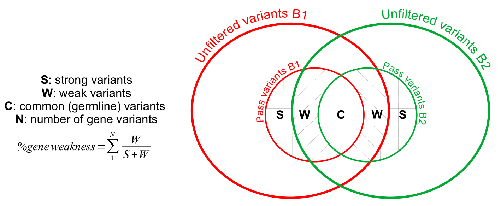

# Description of the input/output files

## Filter

### Intputs

- **Raw vcf file**

Raw vcf file from Funcotator

- **Filters**

The basic filters of LOTUS are the following:
  1. Median base variant quality (MBQ) ≥ 20.
  2. Variant coverage (DP) ≥ 10.
  3. Fractions of variant in the tumour (AF) ≥ 0.1.
  4. Variant depths (AD) ≥ 5.
  5. Population variant frequencies (10<sup>-POPAF</sup>) < 1e-5.
  6. At least one paired read to support a variant (MFRL) > 0. It is possible to skip this filter by using the ```--unpaired``` option which indicates that the original reads are not paired.
  7. A variant must be in a coding region (RNA or protein) and non-silent (Funcotator information). The list of Funcotator annotations allowing to keep a variant is the following: ```MISSENSE```, ```NONSENSE```, ```NONSTOP```, ```RNA```, ```LINCRNA```, ```START_CODON_SNP```, ```DE_NOVO_START_IN_FRAME```, ```DE_NOVO_START_OUT_FRAME```, ```IN_FRAME_DEL```, ```IN_FRAME_INS```, ```FRAME_SHIFT_INS```, ```FRAME_SHIFT_DEL```, ```START_CODON_INS```, ```START_CODON_DEL```, ```DE_NOVO_START_IN_FRAME```, ```DE_NOVO_START_OUT_FRAME``` and finally ```SPLICE SITE``` associated with one of the other annotations. These variants are considered to have a potential functional impact, the others are annotated as ```NOT_FUNCTIONAL``` and are not saved. 

Except for the Funcotator annotations (7), these filters can be modified to filter the variant in a more or less stringent way.

### Outputs

It is advisable to use the ```-o``` option of LOTUS filter in order to choose a prefix corresponding to your samples, by default the output files will be named ```output.filtered.vcf``` and ```output.passed.vcf```

- **Filtered vcf file** 

The ```filtered.vcf``` file is a vcf file that contains the variants of the original vcf file with an annotation indicating the filters not passed in the *Info field*.

- **Passed vcf file** 

The ```passed.vcf``` file is a vcf file that contains only the variants passing the filters. 

---

## Summarise

### Intputs

- **Vcf file from filter module**

The ```passed.vcf``` is mandatory but the ```filtered.vcf``` is optional. The ```filtered.vcf``` file is used to add information on the total number of variants as well as details of those not passing the ```NOT_FUNCTIONAL``` (LOTUS), ```germline``` (GATK) and ```panel_of_normals``` (GATK) filters. 

- **Reference genome fasta file**

Genome fasta file with the extensions : *.fasta*, *.fa* or *.fan*. This file must be the same one used to align the raw data. This file is used to retrieve the flanking bases when creating the mutational profile graph detailing the snp types found among the variants passing the filters.

On the first run of this module, the information from the genome fasta file is serialized and saved using [pickle](https://docs.python.org/3/library/pickle.html) (*.pk*, *.pickle*). The *.pk* file created can be used later to retrieve information more quickly without parsing the entire genome fasta file, e.g. to process another sample.

### Outputs

- **Stats.txt file**

By default the statistics file will be output as ```stats.txt```. 

The output file structure is as follows :

```
########################### filtered.vcf ###########################
###########################
Total variants : X
###########################
germline: X      |      PON: X      |      not functional: X
germline & PON: X      |      germline &  not functional: X      |      PON &  not functional: X
germline & PON & not functional: X

########################### passed.vcf ###########################
###########################
PASS : X
###########################
---
variants : X
---
SNP : X       DNP : X TNP : X NP : X
INDEL : X      INSERTION : X, DELETION : X
---
Impacted genes : X (list in MutatedGenes.xlsx)
---
SNP : X      DNP : X      TNP : X      NP : X
INDEL : X      INSERTION : X, DELETION : X
```

:warning: The filtered part will only be present if the ```filtered.vcf``` file is passed to the *summarise* module.

- **Mutated genes file**

The default value of this file is ```MutatedGenes.tsv|.xlsx```.
It contains the list of genes impacted by the variants in the passed file (variants that pass the filters). For each impacted gene, the following information is given:

  - ```Gene name```: Gene name ([HGNC](https://www.genenames.org/) symbol).
  - ```Tumour burden```: Total number of different variants impacting this gene.
  - ```Details (snp, dnp, tnp, onp, insertion, deletion)```: Details of the number of variants impacting the gene by type of variant: snp (Single Nucleotide Polymorphism), dnp (Double nucleotide polymorphism), tnp (Triple nucleotide polymorphism), onp (Oligo-nucleotide polymorphism), ins (insertion) and del (deletion)
  - ```Ref```: Sequences in the reference genome.
  - ```Alt variant(s)```: Variants in the sample genome in the same order that *Ref*.
  - ```Chromosome```: Chromosome on which the gene is located.
  - ```Position(s)```: Variants positions in the same order that *Ref* and *Alt variant(s)*.

- **Mutational SNP profile files**

The mutational SNP profile file is a graphical file representing the percentage of mutations in each snp plotted according to its sequence context. This graphic is output in two image formats: *svg* and *png*. The default output for this graph is in ```profile.svg|.png``` but the ```-p``` option allows you to change the output name.

In addition to the graphical output the associated percentages and counts for each snp context are also output in a file named as the graphical output but with the *.tsv* suffix, i.e. ```profile.tsv```.

- **Indel size profile files**

The indel size profile file is a graphical file representing the percentage of insertions/deletions plotted according to their size. As with the mutational profile, this graph is output in two image formats: *svg* and *png*. The default output for this graph is ```indel.svg|.png``` but the ```-i``` option allows you to change the name of the output.

In addition to the graphical output, the percentages and associated numbers for each indel size are also produced in two files separating insertions from deletions. These files are named like the graphical output but with the *.insertion.tsv* and *.deletion.tsv* suffix, i.e. ```indel.deletion.tsv``` and ```indel.insertion.tsv```.

---

## Compare

### Intputs

- **Configuration file**

The configuration file is the only file needed to run the compare module. 

This configuration file must contain the path to the ```filtered.vcf``` and ```passed.vcf``` files (outputs of the *filter* module) for the different time points (**TP**) of a sample. In addition to that it also takes the path to the ```profile.tsv```,```indel.insertion.tsv``` and ```indel.deletion.tsv``` files (outputs of the *summary* module).

An example of a configuration file is available [here](https://github.com/gsiekaniec/LOTUS/blob/main/example_config.txt). It looks like this:
```
3

### VCF files ###
# Filtered.vcf files (from LOTUS filter)

- filtered:
/path/to/file1.filtered.vcf
/path/to/file2.filtered.vcf
/path/to/file3.filtered.vcf

# Corresponding Passed.vcf files in the same order (from LOTUS filter)

- pass:
/path/to/file1.pass.vcf
/path/to/file2.pass.vcf
/path/to/file3.pass.vcf

### TSV files ### (same order than vcf files)
# snp profile tsv 

- profile:
/path/to/profile1.tsv
/path/to/profile2.tsv
/path/to/profile3.tsv

# insertion count tsv (None if no file)

- insertion:
/path/to/insertion1.tsv
None
/path/to/insertion3.tsv

# deletion count tsv (None if no file)

- deletion:
/path/to/deletion1.tsv
/path/to/deletion2.tsv
None
```

The first line containing a number (here 3) corresponding to the number of time points for the treated sample. In the case where more than two TPs are given the files are compared two by two in temporal order. Thus the first TP is compared to the second, then the second is compared to the third and so on.

:warning: Sometimes it may appear that there is no insertion or deletion in a sample. In this case, it is possible to put *None* in the corresponding indel path and no indel graph will be produced for comparison with this TP.
 
 - **Reference genome annotation file**
 
The reference genome annotation file is a *gff3* file containing informations about genes presents in the genome. In the case of the *hg38* version of the human genome, this file can be found [here](https://ftp.ensembl.org/pub/release-108/gff3/homo_sapiens/) or in the [LOTUS_external_files](https://github.com/gsiekaniec/LOTUS/blob/main/LOTUS_external_files/Homo_sapiens.GRCh38.108.chr.gff3.gz) directory.

As for the genome fasta file in the *summarise* module, during the first run of the *compare* module, the information from the reference genome annotation file is serialized and saved using [pickle](https://docs.python.org/3/library/pickle.html) (*.pk*, *.pickle*). The *.pk* file created can be used later to retrieve information more quickly without parsing the entire gff3 file, e.g. to process another TP or sample. :warning: When using a *.pk* file instead of the original file the ```--pickle_gff3``` option must be specified.

### Outputs

- **Mutated genes file**

The default value of this file is ```TPn_TPn+1_compared.MutatedGenes.tsv|.xlsx``` where TP*n* and TP*n+1* are the name of the first and second filtered.vcf file, e.g. if your vcf file for the first TP is file1.filtered.vcf and the name for the second TP vcf file is file2.filtered.vcf, the final output will be ```file1_file2_compared.MutatedGenes.tsv|.xlsx```. However is possible to replace the ```compared``` part by using the **-o** option.

This ```TPn_TPn+1_compared.MutatedGenes.tsv|.xlsx``` file contains the list of impacted genes specific to TP*n* or TP*n+1*. The details of the information provided for each gene are as follows:
  - ```Gene symbol```: Gene name ([HGNC](https://www.genenames.org/) symbol).
  - ```Chromosome```: Chromosome on which the gene is located.
  - ```Gene position start```: Gene start position, extract from the reference genome annotation file (gff3).
  - ```Gene position end```: Gene end position, extract from the reference genome annotation file (gff3).
  - ```Tumour burden (symmetrical difference)```: Total number of different variants impacting the gene. Only variants specific to TP*n* or TP*n+1* are considered. Variants common to both TPs are not taken into account.
  - ```Gene weakness (in %)```: Percentage of gene weakness (see X part below)
  - ```TPn```: Number of different variants impacting the gene and specific to TP*n*.
  - ```g.TPn```: Variants representation relative to the linear genomic reference sequence specific to TP*n* ([HGVS](https://varnomen.hgvs.org/) nomenclature). 
  - ```c.TPn```: Variants representation relative to the coding DNA reference sequence specific to TP*n* ([HGVS](https://varnomen.hgvs.org/) nomenclature).
  - ```p.TPn```: Variants representation relative to the protein reference sequence specific to TP*n* ([HGVS](https://varnomen.hgvs.org/) nomenclature).
  - ```TPn+1```: Number of different variants impacting this gene and specific to TP*n+1*.
  - ```g.TPn+1```: Variants representation relative to the linear genomic reference sequence specific to TP*n+1* ([HGVS](https://varnomen.hgvs.org/) nomenclature).
  - ```c.TPn+1```: Variants representation relative to the coding DNA reference sequence specific to TP*n+1* ([HGVS](https://varnomen.hgvs.org/) nomenclature).
  - ```p.TPn+1```: Variants representation relative to the protein reference sequence specific to TP*n+1* ([HGVS](https://varnomen.hgvs.org/) nomenclature).

In addition to the above information, it is possible, by adding the ```--additional_gene_information``` option, to display additional human cancer specific information from external databases for each gene (blank if no informations for a gene):

  - ```CancerHotSpot```: Informations from the [Cancer HotSpots](https://www.cancerhotspots.org/)[^1] database.
  - ```CIViC```: Informations from the [Clinical Interpretation of Variants in Cancer](https://civicdb.org/)[^2] database.
  - ```COSMIC```: Informations from the [Catalogue Of Somatic Mutations In Cancer](https://cancer.sanger.ac.uk/cosmic)[^3] database.
  - ```DoCM```: Informations from the [Database of Curated Mutations](http://www.docm.info/)[^4] database.
  - ```IntOGen```: Informations from the [Integrative Onco Genomics](https://www.intogen.org/)[^5] database.
  - ```TSGene 2.0```: Informations from the [Tumor suppressor gene database](https://bioinfo.uth.edu/TSGene/)[^6] database.
       
Informations from these different databases is available in the [LOTUS_external_files](https://github.com/gsiekaniec/LOTUS/blob/main/LOTUS_external_files/Lotus_ExternalBases_202301.xlsx).
       
[^1]: [Matthew T. Chang *et al*. Accelerating Discovery of Functional Mutant Alleles in Cancer. Cancer Discov 1 February 2018; 8 (2): 174–183.](https://doi.org/10.1158/2159-8290.CD-17-0321)
[^2]: [Griffith, M. *et al*. CIViC is a community knowledgebase for expert crowdsourcing the clinical interpretation of variants in cancer. Nat Genet 49, 170–174 (2017).](https://doi.org/10.1038/ng.3774)
[^3]: [Sondka, Z. *et al*. The COSMIC Cancer Gene Census: describing genetic dysfunction across all human cancers. Nat Rev Cancer 18, 696–705 (2018).](https://doi.org/10.1038/s41568-018-0060-1)
[^4]: [Ainscough, Benjamin J *et al*. “DoCM: a database of curated mutations in cancer.” Nature methods vol. 13,10 (2016): 806-7.](https://doi.org/10.1038/nmeth.4000)
[^5]: [Martínez-Jiménez, F. *et al*. A compendium of mutational cancer driver genes. Nat Rev Cancer 20, 555–572 (2020).](https://doi.org/10.1038/s41568-020-0290-x)
[^6]: [Min Zhao *et al*. TSGene 2.0: an updated literature-based knowledgebase for tumor suppressor genes, Nucleic Acids Research, Volume 44, Issue D1, 4 January 2016, Pages D1023–D1031.](https://doi.org/10.1093/nar/gkv1268)

#### Gene weakness

The *compare* module introduces a new concept of weakness and weakness percentage.

To make it simple, when comparing two vcf files TPs coming from the same individual, we compare the variants of the two vcf. To do this, we use the files with the variants that pass the LOTUS and GATK filters (```passed.vcf``` file).

In the case of LOTUS the files containing the variants that do not pass these filters are also used (```filtered.vcf``` file). We can then consider two types of variants: 
  1. the so-called *strong* variants (**S** in the figure below) are those which are found in the ```passed.vcf``` files for a TP but not in the variants which do not pass the filters (```filtered.vcf```) in the other TP.
  2. the so-called *weak* variants (**W** in the figure below) are those that pass the filters (```passed.vcf```) in one of the two TP but are also found in the filtered variants (```filtered.vcf```) of the other TP. These variants are said to be *weak* because their specificity at one of the two TP is more likely to result from errors linked to filters that are too strict or to poor sequencing of the variant zone in one of the two TP. 
  
Finally, the common variants (**C** in the figure below) in the two ```filtered.vcf``` files are not taken into account because they are either germline variants, or variants that do not evolve over time and therefore theoretically have less impact on the evolution from TP*n* to TP*n+1*.

At the gene level, we can then calculate a *percentage of weakness* for the genes impacted by one or several *weak* and/or *strong* variants (see *%gene weakness* figure below).
This *percentage of weakness* (from 100% if all variants are weak to 0% if all variants are strong) gives us additional information on the reliability of the impacted genes.

<p align="center">
  
</p>

---

## Merge

### Intputs

- **Configuration file**

The only file needed for the *merge* module is the configuration file (```.txt```).

This configuration file contains the list of genes (```MutatedGenes.tsv``` or ```MutatedGenes.xlsx``` from the *compare* step) for all samples, one file per line (either xlsx or tsv). For example:

``` 
sample1_TP1_TP2.MutatedGenes.xlsx
sample2_TP1_TP2.MutatedGenes.tsv
sample3_TP1_TP2.MutatedGenes.tsv
```

- **Cytoband file**

To create the graph showing the impacted genes on the cytoband maps of the chromosomes (```.tsv```), the file containing the position of these cytobands must be provided. 

For the hg38 version of the human genome, this file can be found [here](https://genome.ucsc.edu/cgi-bin/hgTables) or provided with [LOTUS](https://github.com/gsiekaniec/LOTUS/blob/main/LOTUS_external_files/hg38_cytoband.tsv).


### Outputs

- **Mutated genes file** 

The default value of this file is ```union.MutatedGenes.tsv|.xlsx```.
It contains the list of common impacted genes for all samples given in the configuration file. For each impacted gene a large amount of information can be found such as :

XXX


## Gene Ontology Enrichment Analysis

In addition to the outputs presented above, the three modules *summarise*, *compare* and *merge* offer the possibility to request a GOEA based on biological process terms from the output gene lists using the ```--enrichment``` option. 

These GOEAs are performed using the ToppGene[^7] and PANTHER[^8] APIs and output in files suffixed with ```Panther_enrichment.tsv|.xlsx``` and ```ToppGene_enrichment.tsv|.xlsx```.

The information contained in the columns of these files is as follows:

XXX


[^7]: [Chen,J. et al. (2009) ToppGene Suite for gene list enrichment analysis and candidate gene prioritization. Nucleic Acids Res., 37, W305-11.](https://academic.oup.com/nar/article/37/suppl_2/W305/1149611?login=true)
[^8]: [Mi,H. et al. (2019) Protocol Update for large-scale genome and gene function analysis with the PANTHER classification system (v.14.0). Nat. Protoc., 14, 703-721.)](https://www.nature.com/articles/s41596-019-0128-8)


